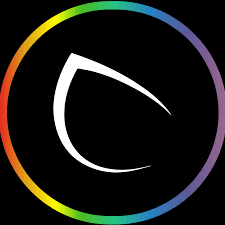
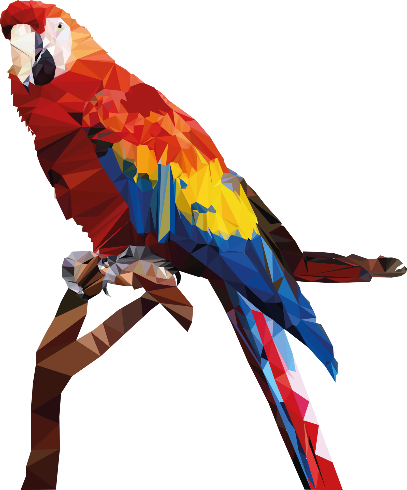
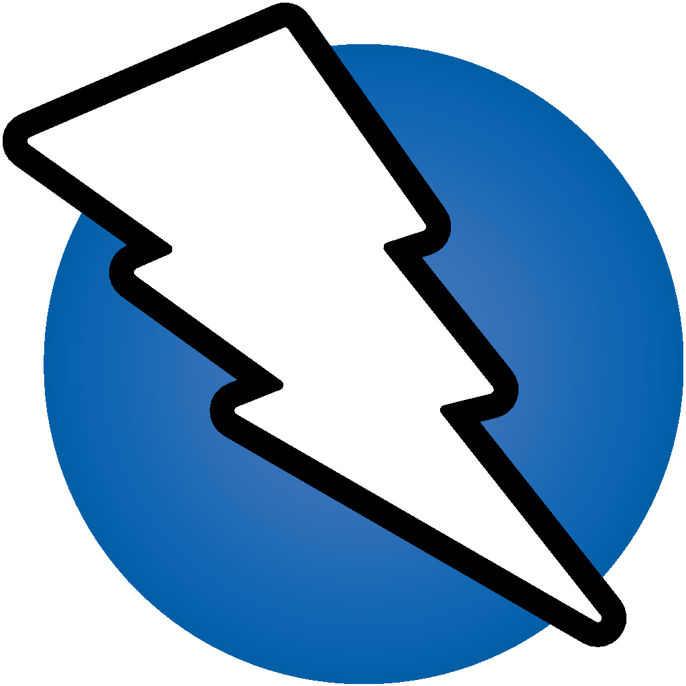

<h3 align="center">
  Welcome to M Tabarik Asif's profile!
  
</h3>

<!-- Typing SVG  - https://readme-typing-svg.herokuapp.com/demo/ 
leetcode: https://leetcard.jacoblin.cool/ -->
<h2 align="center">
  
  </h2>
 
 <!-- platfrom -->
 

  
  &#8287;&#8287;&#8287;&#8287;&#8287;
  
  &#8287;&#8287;&#8287;&#8287;&#8287;
  
  &#8287;&#8287;&#8287;&#8287;&#8287;
  

<!-- social -->
 

   
  &#8287;&#8287;&#8287;&#8287;&#8287;
  
  &#8287;&#8287;&#8287;&#8287;&#8287;
  
  &#8287;&#8287;&#8287;&#8287;&#8287;
  
  &#8287;&#8287;&#8287;&#8287;&#8287;
  
  &#8287;&#8287;&#8287;&#8287;&#8287;
  
  &#8287;&#8287;&#8287;&#8287;&#8287;
  
  &#8287;&#8287;&#8287;&#8287;&#8287;
  

  
  
👋 Greetings! I'm M TABARIK ASIF, a passionate advocate for cybersecurity, ethical hacking, and bug bounty hunting. 💻 As a Computer Science Graduate, I have over 3 years of hands-on experience in offensive security, specializing in Web/API hacking, automation, virtualization, and other security related fields such as ACTIVE DIRECTORY, CLOUD SECURITY. My proficiency in Python and bash scripting further enhances my ability to address cybersecurity challenges.

🛡️ Currently as a freelance bug bounty hunter, I actively contribute to fostering a cybersecurity-aware community and engaging in collaborative initiatives. My commitment to cyber defense extends beyond the academic realm into real-world scenarios.

🔍 My expertise includes conducting penetration tests, identifying vulnerabilities, and staying ahead of emerging cyber threats. I take pride in my unique approach to problem-solving and collaboration, attributes that have been refined through my experiences as a Bug Bounty Hunter.

💡 Beyond academia, I'm deeply involved in the bug hunting community, continually learning and sharing knowledge. I believe in the power of technology to shape a secure and resilient future.

🔐 Eager to explore opportunities that allow me to contribute to cutting-edge technologies in cybersecurity. Interested fields include penetration testing, secure coding practices, digital forensics, and defensive security.

💼 Let's connect and explore the dynamic world of cybersecurity together. Ready to collaborate on projects that reinforce our digital defenses!

  
  
  
  
- 🔭 I’m currently working on My unique skills.

- 👨‍💻 All of my projects are available at [Projects](https://mtabarikasif.github.io/)

- 💬 Ask me about **Linux, Python, OWASP, vulnerabilities, CMD, PowerShell**

- 📄 Know about my [Experiences](https://mtabarikasif.github.io/#resume)
- 👨‍💻 Hire Me as [Freelancer](https://www.linkedin.com/in/mtabarikasif/)

- ⚡ Fun fact **I Think I love my computer, more then myself.**

<h2 align="left" id="naemazam">Certificates</h2>

>Professional Certificates

<table>
  <tr>
    <td align="center" width="96">
      
       IT Support Proffetional
    </td>
    <td align="center" width="96">
      
       IT Automation with Python Professional
    </td>
    <td align="center" width="96">
      
       CompTIA Security+ (Udemy)
    </td>
    <td align="center" width="96">
      
       Linux Systems
    </td>
     </tr>
</table>

<h2 align="left" id="naemazam">Dev-Hub</h2>

> Progamming languages

<table>
  <tr>
    <td align="center" width="96">
      
       Bash
    </td>
    <td align="center" width="96">
      
       Python
    </td>
    <td align="center" width="96">
      
       C
    </td>
    <td align="center" width="96">
      
       C++
    </td>
     <td align="center" width="96">
      
       SQL
    </td>
  </tr>
  <tr>
    <td align="center" width="96">
      
       Powershell
    </td>
    <td align="center" width="96">
      
       PHP
    </td>
    </tr>
</table>

> Frameworks and libraries

<table>
  <tr>
    <td align="center" width="96">
      
       Arduino
    </td>
    <td align="center" width="96">
      
       GitHub-Action
    </td>
     <td align="center" width="96">
      
       Wordpress
    </td>
     <td align="center" width="96">
      
       Flask
    </td>
    </tr>
</table>

> Databases and cloud hosting

<table>
  <tr>
    <td align="center" width="96">
      
       GitHub Page
    </td>
    <td align="center" width="96">
      
       my-sql
    </td>
    </tr>
</table>

> operating system

<table>
  <tr>
    <td align="center" width="96">
      
       Windows
    </td>
    <td align="center" width="96">
      
       Ret-Hat
    </td>
    <td align="center" width="96">
      
       Debian
    </td>
    <td align="center" width="96">
      
       Raspberry pi
    </td>
    <td align="center" width="96">
      
       kali
    </td>
    <td align="center" width="96">
      
       ARCH
    </td>
    <td align="center" width="96">
      
       android
    </td>
    <td align="center" width="96">
      
       Parrot OS
    </td>
    </tr>
</table>

> Software and tools
<table>
  <tr>
    <td align="center" width="96">
      
       nmap
    </td>
    <td align="center" width="96">
      
       Hacking Tools
    </td>
    <td align="center" width="96">
      
       Git
    </td>
     <td align="center" width="96">
      
       Nessus
    </td>
   <td align="center" width="96">
      
       ZAP Proxy
    </td>
    <td align="center" width="96">
      
       wiershark
    </td>
    <td align="center" width="96">
      
       Visual Studio
    </td>
     <tr>
    <td align="center" width="96">
      
       Jupyter Notebook
    </td>
    <td align="center" width="96">
      
       Sublime
    </td>
    </tr>
</table> 

<!-- table emd-->

<!-- project table -->
 

## 📘 My top  projects

 
 
 
 
 

  

  

<h2> Static Website Project </h2>
  <table> 
    <tr>
    <th> Project name </th>
     <th> Abstract </th>
     <th> GitHub Links </th>
     <th> Documentation Webpage </th>
    </tr>
  <tr>
    <td> Impossible-OS </td>
     <td> Everyone is saying make a OS by using Html CSS and js is not possible that's why I named it Impossible OS. But I Know You will Like IT. </td>
      <td>  <a href="https://github.com/naemazam/Impossible-OS#readme" target="blank"> ReadMe </a> </td>
          <td>  <a href="https://naemazam.github.io/Impossible-OS/" target="blank"> Visit </a> </td>
    </tr>
    <tr>
    <td> Minimal student portfolio </td>
     <td> A simple gift for my student </td>
    <td>  <a href="https://github.com/naemazam/Minimal-student-portfolio#readme" target="blank"> ReadMe </a> </td>
     <td> <a href="https://naemazam.github.io/Minimal-student-portfolio/" target="blank"> WebView </a> </td>
    </tr>
    <tr>
    <td> Font-End Dev Portfolio </td>
     <td> This portfolio Designer For Font-end Dev. A Simple gift for my Fellows </td>
    <td>  <a href="https://github.com/naemazam/Front-end-dev-portfolio#readme" target="blank"> ReadMe </a> </td>
     <td> <a href="https://naemazam.github.io/Front-end-dev-portfolio/" target="blank"> WebView </a> </td>
    </tr>
     <tr>
    <td> Google search clone </td>
     <td> Fully working fake Google search engine clone using html CSS and JS </td>
    <td>  <a href="https://github.com/naemazam/Google-search-clone#readme" target="blank"> ReadMe </a> </td>
     <td> <a href="https://naemazam.github.io/Google-search-clone/" target="blank"> WebView </a> </td>
    </tr>
    <tr>
    <td>My projects </td>
     <td>Let's See. In here I am Combining All of my projects and Works. </td>
    <td>  <a href="https://github.com/naemazam/My-Projects#readme" target="blank"> ReadMe </a> </td>
      <td>  <a href="https://naemazam.github.io/My-Projects/" target="blank"> WebView </a> </td>
    </tr>
  <tr>
    <td> About Me </td>
     <td>It's a Simple Card For Add About me any Of My projects.</td>
    <td>  <a href="https://github.com/naemazam/About-Me#readme" target="blank"> ReadMe </a> </td>
      <td>  <a href="https://naemazam.github.io/About-Me/" target="blank"> WebView </a> </td>
    </tr>
    <tr>
    <td> Ux/UI portfolio</td>
     <td>Fully Responsive UX/UI Portfolio Website Template </td>
    <td>  <a href="https://github.com/naemazam/UXUI-portfolio#readme" target="blank"> ReadMe </a> </td>
      <td>  <a href="https://naemazam.github.io/UXUI-portfolio/" target="blank"> DEMO </a> </td>
    </tr>
  <tr>
    <td> Animate-AutoTyping-Terminal-Portfolio</td>
     <td>Responsive Animated Autotyping terminal Portfolio Using HTML CSS And JavaScript </td>
    <td>  <a href="https://github.com/naemazam/Animate-AutoTyping-Terminal-Portfolio#readme" target="blank"> ReadMe </a> </td>
      <td>  <a href="https://naemazam.github.io/Animate-AutoTyping-Terminal-Portfolio/" target="blank"> DEMO </a> </td>
    </tr>
  <tr>
    <td> HTML CV</td>
     <td>Open-Source CV Website Collection by CV Baba </td>
    <td>  <a href="https://github.com/naemazam/Html-CV#readme" target="blank"> ReadMe </a> </td>
      <td>  <a href="https://github.com/naemazam/Html-CV" target="blank"> -</a> </td>
    </tr>
    <tr>
    <td> Technical Documentation Page</td>
     <td>Technical Documentation Page with html css js </td>
    <td>  <a href="https://github.com/naemazam/Technical-Documentation-Page#readme" target="blank"> ReadMe </a> </td>
      <td>  <a href="https://github.com/naemazam/Technical-Documentation-Page" target="blank"> -</a> </td>
    </tr>
    <tr>
    <td> Doctor-Portfolio</td>
     <td>Technical Documentation Page with html css js </td>
    <td>  <a href="https://github.com/naemazam/Doctor-Portfolio#readme" target="blank"> ReadMe </a> </td>
      <td>  <a href="https://github.com/naemazam/Doctor-Portfolio" target="blank"> -</a> </td>
    </tr>
    <tr>
    <td> CyberPunk Portfolio</td>
     <td>Make a Cyberpunk Personal Portfolio with HTML, CSS and Js </td>
    <td>  <a href="https://github.com/naemazam/CyberPunk-Portfolio#readme" target="blank"> ReadMe </a> </td>
      <td>  <a href="https://github.com/naemazam/CyberPunk-Portfolio" target="blank"> -</a> </td>
    </tr>
  
  
  
   </td>
    <td>  <a href="https://github.com/naemazam/Online-Ludo#readme" target="blank"> ReadMe </a> </td>
      <td>  <a href="https://naemazam.github.io/Online-Ludo/" target="blank"> WebView </a> </td>
    </tr>
  <tr>
    <td>tic-tac-toe Simple VS AI </td>
     <td>tictac-toe with AI </td>
    <td>  <a href="https://github.com/naemazam/tic-tac-toe-Simple-VS-AI#readme" target="blank"> ReadMe </a> </td>
      <td>  <a href="https://naemazam.github.io/tic-tac-toe-Simple-VS-AI/" target="blank"> Play </a> </td>
    </tr>
  <tr>
    <td>Fruit Ninja Game</td>
     <td>Fruit Ninja Game made with Js
    <td>  <a href="https://github.com/naemazam/Fruit-Ninja-Game#readme" target="blank"> ReadMe </a> </td>
      <td>  <a href="https://naemazam.github.io/Fruit-Ninja-Game/" target="blank"> Play </a> </td>
    </tr>
  
  
  
  </table>
  
  

  <h1 align="center">Summary Of My Github Status</h1>

  
 

 

  

<table align="center" border="1">
<tr align="center">
<td colspan="3"></td>
</tr>
<tr align="center">
<td></td>
<td></td>
<td colspan="3"></td>
</tr>
<tr align="center">
<td colspan="3"></td>
</tr>
<tr align="center">
<td colspan="3"></td>
</tr>
</table>
  

  

  
 

  <h1 align="center">Summary Of My Github Live Graph</h1>

  

